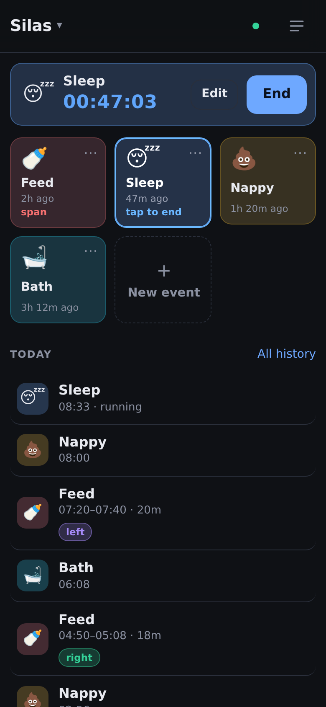
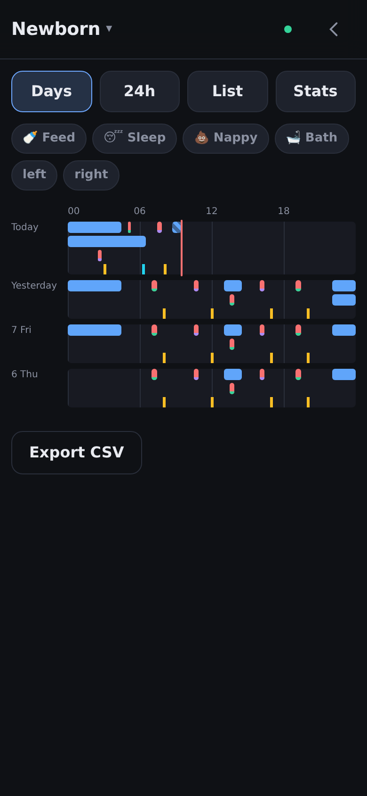
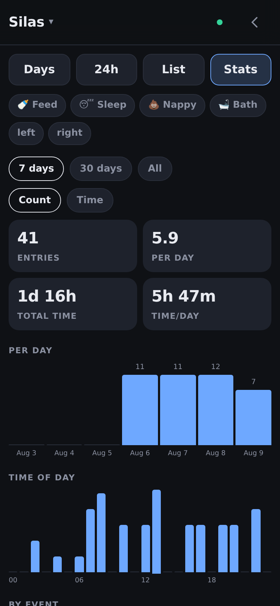
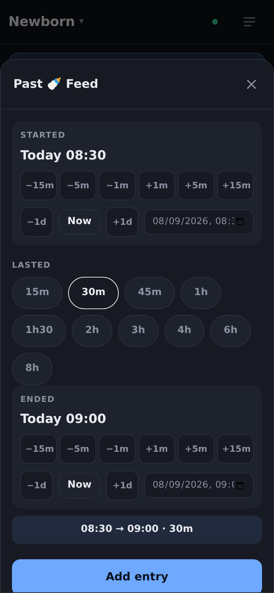

# Logbook

**Track anything that happens over time. One tap to record it. Runs on your own
Fly.io account for about a pound a month.**

<p align="center">
  
  
  
  
</p>

## The problem

Tracking when things happen is easy to start and hard to keep up. Recording an
event has to take less effort than the event itself, or you stop doing it.

Most apps for this fix the categories you are allowed to use, ask for a form
every time, and keep your data on their servers for a monthly fee.

## What it does

- **You define the events.** Name a thing once and it becomes a tile. No event
  names appear in the code, so it works the same for feeds and naps, medication,
  headaches or plant watering.
- **One tap records an event.** No form and no confirmation. For something with
  a duration, one tap starts it and the next tap ends it.
- **Typing is rare.** You type to name a project, an event or a label, and only
  the first time. Times are set with buttons that move them in steps.
- **Every action can be undone.**
- **It works with no signal.** Entries save on the device and sync later.
- **Reading it back is as quick as writing it.** A timeline per day, a rolling
  24 hours, totals per day and per hour, and filters built from your own labels.

## Run it yourself

One command deploys it to your own [Fly.io](https://fly.io) account:

```sh
git clone https://github.com/ragnarula/logbook.git
cd logbook
./install.sh
```

It creates the app, an encrypted disk with daily snapshots and a passcode,
deploys, checks the passcode is enforced, and prints your URL. Re-run it to
update, and your data is left alone.

**Cost.** The disk is about $0.15 a month. The machine stops when nobody is
using it, so you pay for the minutes you use. Fly needs a card on file.

**Your data stays yours.** It is a SQLite file on your disk, in your account,
and any project exports as CSV from inside the app.

On a phone, open the URL and add it to the Home Screen. It then opens like an
app and works without a network.

See [INSTALL.md](INSTALL.md) for details, including using your own domain.

## Share it with one key

Set a passcode and give it to whoever needs it. Everyone with the key sees and
edits the same events. There are no accounts, invitations or permissions to
configure, because two parents tracking one baby should not have to manage them.

One deployment serves one household. A second household runs its own copy, so
their data is separate by construction rather than by a rule in a shared
database.

Signing in lasts, so you do it once per device. It never blocks recording: a
device that cannot reach the server still saves entries and sends them later.

## Features

- **Projects.** Each project owns its event types and labels. Projects never
  share them.
- **Event types.** The user names a type once, then reuses it by tapping a tile.
- **Two kinds of event.** A moment happens at one time. A span starts, then ends
  later.
- **Labels.** The user names a label once, then selects it.
- **Corrections.** The user adjusts times, labels and notes on any entry. To
  change a time, the user taps buttons that move it in fixed steps.
- **Past entries.** The user records something that already finished in one
  step. The user sets the start time, then picks how long it lasted. The app
  saves a complete entry, so the user never has to start an event and repair it
  afterwards.
- **History.** A separate page with three views. **Days** draws one row per day.
  **Last 24 hours** draws one row for the moving window, so a night is not split
  at midnight, and totals each event type below it. **List** shows entries in
  order. The back gesture leaves the page.
- **Stats.** Totals, a bar per day, a bar per hour of the day, and a ranking by
  event type and by label. The user picks the period and, when spans are in
  view, whether to count entries or add up time.
- **Filtering.** The user taps an event type or a label to show only matching
  entries. The app builds both sets of buttons from the project's own data, so a
  new type or label appears without any code change. The same buttons filter the
  stats, so "feeds per day" and "left-side feeds per day" are one screen with one
  more button pressed. The app needs no query builder for this.
- **Labels on the timeline.** Each bar carries a band of its label colours, so
  the user reads labels off the timeline instead of opening each entry.
- **Export.** The server returns one project as CSV.
- **Install.** The user adds the app to a phone home screen.
- **Home Screen buttons.** Each event type provides a link. The user adds that
  link to the iPhone Home Screen using the Shortcuts app, then logs the event
  without opening the app first. A link opens the app, which logs the event and
  offers an undo.
- **Home Screen widget.** The app generates a script for Scriptable. The widget
  lists the spans that are running and the time each one started. The user taps
  a row to end that span. iOS cannot show a live counter in a widget, so the
  widget shows start times instead.

## Design principles

1. **Keep data entry to one tap.** This rule outranks every other feature. To
   log an event, the user taps once. The app opens no form, asks no question and
   needs no confirmation. The keyboard appears only when the user names
   something new, and only the first time. The user sets every other value by
   tapping: times move in fixed steps, and labels, icons and colours come from
   lists. A new feature must not add a step to this path.
2. **Keep the code generic.** No event name or label name appears in the code.
   The only meaning the code uses is the kind, moment or span, and the user sets
   that.
3. **Write locally first.** Every change reaches the device before the network.
   The user never waits for a request.
4. **Resolve conflicts by time.** Each row carries the time of its last change.
   The newer change wins. Merging happens per row.
5. **Keep data.** Deletes only set a flag. Removing an event type keeps the
   entries already logged.
6. **Serve code from the network first.** The offline cache must never decide
   which version of the app runs.
7. **Make actions reversible.** The user can undo an action instead of
   confirming it first.

## High level architecture

**Server.** One Python process using FastAPI, with one SQLite file. It stores
rows, merges incoming changes and returns changes. It holds no rules about what
an event means.

**Client.** Static HTML, CSS and JavaScript. No build step and no external
libraries, so the browser loads only files this service serves.

**Device storage.** The browser keeps a full copy of the project data in
IndexedDB. A flag marks each row the server has not yet accepted.

**Sync.** One endpoint handles both directions. The client sends its changed
rows and a position marker. The server replies with every row that changed after
that marker. A counter on the server orders all changes, so one number describes
how far a device has caught up. Devices create rows with their own identifiers,
so two offline devices never collide.

**Offline shell.** A service worker stores the application files. The app opens
without a network. The stored data still comes from IndexedDB.

**Deployment.** One Docker container, with the SQLite file on a persistent
disk. An install script deploys it to Fly.io, which supplies the address, the
certificate and daily snapshots of the disk.

**Access.** One passcode protects the whole deployment, and signing in leaves a
long-lived session on the device. There are no user accounts: one deployment
serves one household, and a second household runs its own. Authentication never
blocks recording. A device that cannot sign in still saves events locally and
sends them once it can, because losing a night of entries to an expired session
would be worse than the protection is worth.

## Licence

[0BSD](LICENSE). Use it for anything, with or without credit.

This repository is not accepting issues or pull requests. Fork it and make it
yours.
